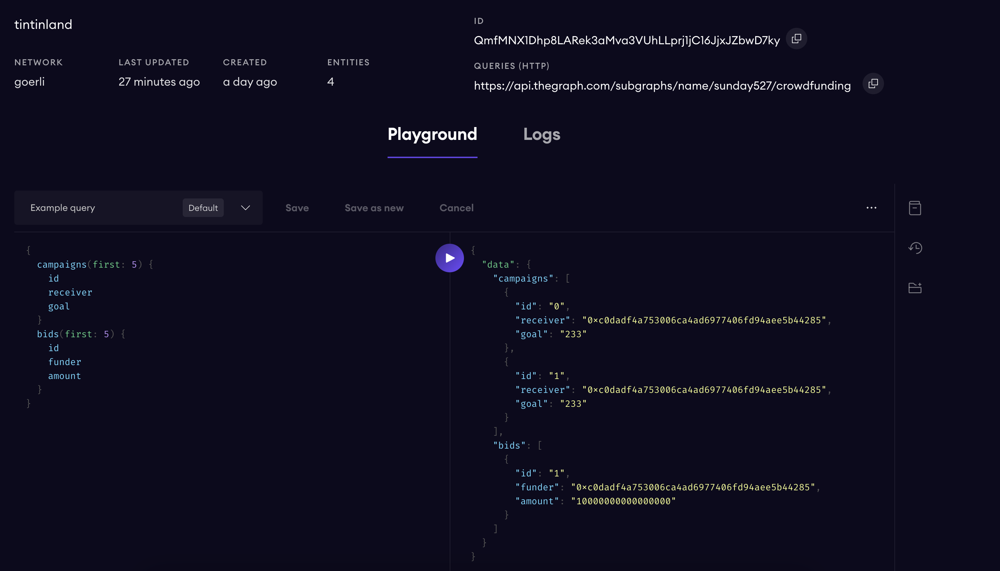

# subgraph-demo

## 作业1
```
0x2b307C1E48c2c1625A3b2786126785C223A81042
```

## 作业2
<https://thegraph.com/hosted-service/subgraph/sunday527/crowdfunding>

## 作业3
### 交易HASH：
```
0xffe5e984f02876e14435baa80c3fc47204c2e5d4103c465198279103a7296ac0
```

### 结果：
